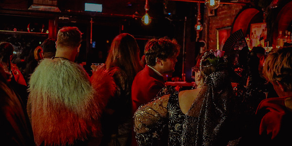

    

    
    

Melbourne remained without leadership nor laws, but it did at least have an Elysium where the Kindred could meet, socialize, and plot. The Toreador, social creatures in the extreme, called for a gathering ostensibly to welcome the Gangrel and Nosferatu clans who were establishing themselves properly in the domain, but rumours abounded that an emissary of the Camarilla would be in attendance as well.

This emissary kept their identity hidden but the Keeper of Elysium, Lady Catherine, read a missive they delivered to the gathering. This letter was ostensibly from the Governor who requested the terms Melbourne wanted in return for their grand-childe kept as hostage (the same Ventrue who had been destroyed at the previous meeting.) Eventually, the emissary revealed themselves and were immediately set upon, in particular by the Gangrel known as Rumble. After yet another violent meeting, a leader arose from the Brujah. Baron Leo had begun his reign.